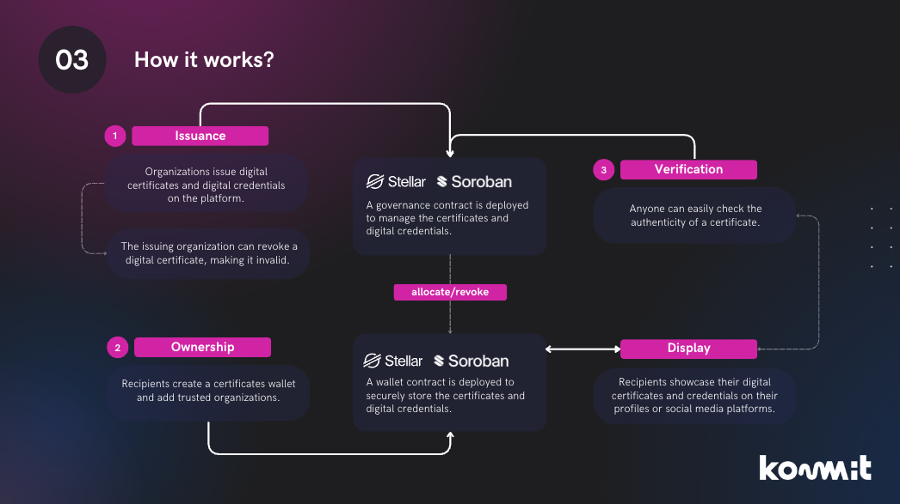

# Chaincerts Governance


[](https://github.com/kommitters/chaincerts_governance/blob/main/LICENSE)
[](https://coveralls.io/github/kommitters/chaincerts_governance)
[](https://api.securityscorecards.dev/projects/github.com/kommitters/chaincerts_governance)

**Chaincerts Governance** is a set of smart contracts designed for the creation, distribution, and revocation of digital certificates on the blockchain. The goal of this project is to provide a decentralized and secure way to issue and manage certificates using Soroban smart contracts for [**Chaincerts**](https://chaincerts.co).

This repository contains two smart contracts:

- [**Cert Governance Contract**](https://github.com/kommitters/chaincerts_governance/tree/main/certs_governance):
  The `cert_governance` contract is responsible for defining the governance rules for Chaincerts. With this contract, users can set the revocability and expiration of certificates, define which users can receive a certificate, and restrict the distribution of certificates. Additionally, the `cert_governance` contract is responsible for executing the distribution and revocation actions for certificates to different users.

- [**Cert Wallet Contract**](https://github.com/kommitters/chaincerts_governance/tree/main/certs_wallet):
  The `cert_wallet` contract stores the Chaincerts of a specific user, and each user must have their own `cert_wallet`. This contract allows users to view their Chaincerts, add organizations authorized to issue certificates to them, and execute distribution and revocation actions on their certificates. Only functions that can be executed by the `cert_governance` contract can modify certificates in a `cert_wallet`.

## System overview
The following image explains how the smart contracts handle the certificates governance process.


## Contracts workflow
1. We need an account to be used for deploying the contracts, it can be created on the Stellar laboratory using the Friendbot tool.
2. There are 2 important aspects on this process, the wallet contract which allows users to hold and manage their certificates, and the governance contract, allowing organzations to issue, verify and distribute certificates to the user wallets.
3. Both contracts require to be initialized, in order to add the basic configuration to them.
4. Wallets must include the organizations on their access control list,to authorize them for distributing certificates to the wallet.
5. When a wallet authorizes an organization, it can proceed to distribute the certificates using the governance contract.
	a. Organizations can also revoke certificates, when revocability is allowed by the governance contract.
	b. Certificates can also be expirable, if an expiration_time is provided during the contract initialization.
	c. Only the organization who distributed a certificate, is allowed to revoke it.


## Pre-requirements
To be able to work with the contracts, you'll need to install Rust and Soroban, this process is explained on the [Soroban setup](https://soroban.stellar.org/docs/getting-started/setup).

## Setup
``` 
# Clone the repository 
git clone git@github.com:kommitters/chaincerts_governance.git

# Build the project and get dependencies 
cd chaincerts_governance
cargo build
 ```

## Testing
To test the contract run `cargo test -- --show-output` or ` cargo test -- --nocapture`
## Contracts deployment and usage

All this steps require the [Pre-requirements](#pre-requirements) and [Setup](#setup) 

1. Build both contracts with `cargo build --target wasm32-unknown-unknown --release`
2. Create the deployer account [Futurenet](https://laboratory.stellar.org/#account-creator?network=futurenet)

| Name | Key |
| --- | --- |
| Org Public Key | GARAH5FN5QFOVECBFSZHRXK3EBEXMZVZCJZAXMRWBZTEZN2KWDKDWQWB |
| Org Secret Key | SAHQNAPK4KI5HOSQJZPQICNYRQZZTHLBG3ESAU6I5KTQRPZTGA5WGE3N |

3. Deploy certs_governance contract
```
soroban contract deploy \
    --source-account <org-secret-key> \
    --rpc-url https://rpc-futurenet.stellar.org:443 \
    --network-passphrase 'Test SDF Future Network ; October 2022' \
    --wasm target/wasm32-unknown-unknown/release/certs_governance.wasm
sucess
sucess
<governance_contract_id>
```
4. Initialize certs_governance contract, to initialize this contract we can do it by sending the addresses of the receivers that will receive the contract or by sending the number of certificates that can distribute this contract, in case both values enter null it is initialized with a distribution limit of 10.

**initialize with distribution_limit and expiration_date**

```
soroban contract invoke \
    --source-account <org-secret-key> \
    --rpc-url https://rpc-futurenet.stellar.org:443 \
    --network-passphrase 'Test SDF Future Network ; October 2022' \
    --id <governance_contract_id> \
    -- initialize \
    --file_storage 66696c65 \
    --name 636f6e74726163742031 \
    --receivers null \
    --distribution_limit 5 \
    --governance_rules '{ "vec": [{ "bool": true }, { "vec": [{ "symbol": "Some" }, {"u64": 31556926}] }] }' \
    --organization '{"id": "6f726731" , "admin": "<org-public-key>"}'
```

**Initialize with receivers and expiration_date**

```
soroban contract invoke \
    --source-account <org-secret-key> \
    --rpc-url https://rpc-futurenet.stellar.org:443 \
    --network-passphrase 'Test SDF Future Network ; October 2022' \
    --id <governance_contract_id> \
    -- initialize \
    --file_storage 66696c65 \
    --name 636f6e74726163742031 \
    --receivers '["<receiver-public-key>","<receiver-public-key>"]' \
    --distribution_limit null \
    --governance_rules '{ "vec": [{ "bool": true }, { "vec": [{ "symbol": "Some" }, {"u64": 31556926}] }] }' \
    --organization '{"id": "6f726731" , "admin": "<org-public-key>"}'
```

**Initialize without expiration_date**

```
soroban contract invoke \
    --source-account SC54VFEAE3MXFJ2QYR5TCJDZYIYADAJFUPGZIDIEOFTAYQRMOVLRHM6U \
    --rpc-url https://rpc-futurenet.stellar.org:443 \
    --network-passphrase 'Test SDF Future Network ; October 2022' \
    --id a13d49e0eb690e002940fe74e8d1304989a1e0f30218ec2317975925e7cfb17e \
    -- initialize \
    --file_storage 66696c65 \
    --name 636f6e74726163742031 \
    --receivers null \
    --distribution_limit 5 \
    --governance_rules '{ "vec": [{ "bool": true }, { "vec": [{ "symbol": "None" }] }] }' \
    --organization '{"id": "6f726731" , "admin": "<org-public-key>"}'
```
> **Note** The `governance_rules` field is a tuple with two fields. The first field is a `bool` value that indicates whether the contract is `revocable` or not. The second field is `expiration_time`, a field of type `OptionU64` that represents the duration of validity of the issued certificate. Time is managed in `Epoch Unix Timestamps` format. For this example, we will use the value of `31556926`, which equals one year. This means that the certificate will only be valid for one year after distribution. For more information on this date format, please visit the following website: https://www.unixtimestamp.com/
5. Create user account with stellar laboratory [Futurenet](https://laboratory.stellar.org/#account-creator?network=futurenet)

| Name | Key |
| --- | --- |
| Receiver Public Key | GARAH5FN5QFOVECBFSZHRXK3EBEXMZVZCJZAXMRWBZTEZN2KWDKDWQWD |
| Receiver Secret Key | SAHQNAPK4KI5HOSQJZPQICNYRQZZTHLBG3ESAU6I5KTQRPZTGA5WGE3Q |

6. Deploy certs_wallet contract
```
soroban contract deploy \
    --source-account <receiver-secret-key> \
    --rpc-url https://rpc-futurenet.stellar.org:443 \
    --network-passphrase 'Test SDF Future Network ; October 2022' \
    --wasm target/wasm32-unknown-unknown/release/certs_wallet.wasm

sucess
sucess
<wallet_contract_id>
```
7. Initialize certs_wallet contract
```
soroban contract invoke \
    --source-account <receiver-secret-key> \
    --rpc-url https://rpc-futurenet.stellar.org:443 \
    --network-passphrase 'Test SDF Future Network ; October 2022' \
    --id <wallet_contract_id> \
    -- initialize \
    --owner <receiver-public-key>
```
8. Include the organization on the wallet Access Control List.
```
soroban contract invoke \
    --source-account <receiver-secret-key> \
    --rpc-url https://rpc-futurenet.stellar.org:443 \
    --network-passphrase 'Test SDF Future Network ; October 2022' \
    --id <wallet_contract_id> \
    -- add_organization \
    --org_id 6f726731
```
9. Verify organization was succesfully included.
```
soroban contract invoke \
    --source-account SA6BUT3AQCI757TGKZDZYFOX6ABNNR4SOSB3IS6POZ4D7EUOPOBEFB4C \
    --rpc-url https://rpc-futurenet.stellar.org:443 \
    --network-passphrase 'Test SDF Future Network ; October 2022' \
    --id b38c29ee40c874afebd34b6b82b9d2107ef87045d475db8b074e2e02c8d49f77 \
    -- get_access_control_list
```
10. Verify there aren't chaincerts on the wallet.
```
soroban contract invoke \
    --source-account SA6BUT3AQCI757TGKZDZYFOX6ABNNR4SOSB3IS6POZ4D7EUOPOBEFB4C \
    --rpc-url https://rpc-futurenet.stellar.org:443 \
    --network-passphrase 'Test SDF Future Network ; October 2022' \
    --id b38c29ee40c874afebd34b6b82b9d2107ef87045d475db8b074e2e02c8d49f77 \
    -- get_chaincerts
```
11. The organization has already been added to the Access Control List of the wallet, then we can distribute a certificate from the certs_governance.
```
soroban contract invoke \
    --source-account SC54VFEAE3MXFJ2QYR5TCJDZYIYADAJFUPGZIDIEOFTAYQRMOVLRHM6U \
    --rpc-url https://rpc-futurenet.stellar.org:443 \
    --network-passphrase 'Test SDF Future Network ; October 2022' \
    --id a13d49e0eb690e002940fe74e8d1304989a1e0f30218ec2317975925e7cfb17e \
    -- distribute \
    --admin <org-public-key> \
    --receiver <receiver-public-key> \
    --wallet_contract_id <wallet_contract_id>\
    --cid 516d647479665459625653334b3969597142506a58786e346d624237614276456a59477a59576e7a52634d724543\
    --distribution_date 1681414979
```
12. Verify the wallet now contain a certificate.
```
soroban contract invoke \
    --source-account SA6BUT3AQCI757TGKZDZYFOX6ABNNR4SOSB3IS6POZ4D7EUOPOBEFB4C \
    --rpc-url https://rpc-futurenet.stellar.org:443 \
    --network-passphrase 'Test SDF Future Network ; October 2022' \
    --id b38c29ee40c874afebd34b6b82b9d2107ef87045d475db8b074e2e02c8d49f77 \
    -- get_chaincerts
```
13. Revoke the certificate using the Governance contract.
```
  soroban contract invoke \
    --source-account <org-secret-key> \
    --rpc-url https://rpc-futurenet.stellar.org:443 \
    --network-passphrase 'Test SDF Future Network ; October 2022' \
    --id <governance_contract_id> \
    -- revoke \
    --admin <org-public-key> \
    --holder <receiver-public-key> \
    --wallet_contract_id <wallet_contract_id>
```
14. Verify certificate is marked as revoked on the wallet.
```
soroban contract invoke \
    --source-account SA6BUT3AQCI757TGKZDZYFOX6ABNNR4SOSB3IS6POZ4D7EUOPOBEFB4C \
    --rpc-url https://rpc-futurenet.stellar.org:443 \
    --network-passphrase 'Test SDF Future Network ; October 2022' \
    --id b38c29ee40c874afebd34b6b82b9d2107ef87045d475db8b074e2e02c8d49f77 \
    -- get_chaincerts
```

# Additional Functions:

## Certs Governane
1. This function returns the name of the certificate
```
soroban contract invoke \
    --source-account <org-secret-key> \
    --rpc-url https://rpc-futurenet.stellar.org:443 \
    --network-passphrase 'Test SDF Future Network ; October 2022' \
    --id <governance_contract_id> \
    -- name
```
2. This function returns whether the certificate is revocable or not.
```
soroban contract invoke \
    --source-account <org-secret-key> \
    --rpc-url https://rpc-futurenet.stellar.org:443 \
    --network-passphrase 'Test SDF Future Network ; October 2022' \
    --id <governance_contract_id> \
    -- is_revocable
```
3. This function returns the expiration time used to calculate the expiration_date.
```
soroban contract invoke \
    --source-account <org-secret-key> \
    --rpc-url https://rpc-futurenet.stellar.org:443 \
    --network-passphrase 'Test SDF Future Network ; October 2022' \
    --id <governance_contract_id> \
    -- expiration_time
```
4. This function returns the number of certificates the contract allows to distribute.
```
soroban contract invoke \
    --source-account <org-secret-key> \
    --rpc-url https://rpc-futurenet.stellar.org:443 \
    --network-passphrase 'Test SDF Future Network ; October 2022' \
    --id <governance_contract_id> \
    -- distribution_limit
```
6. This function returns the number of certificates already distributed.
```
soroban contract invoke \
    --source-account <org-secret-key> \
    --rpc-url https://rpc-futurenet.stellar.org:443 \
    --network-passphrase 'Test SDF Future Network ; October 2022' \
    --id <governance_contract_id> \
    -- supply
```
7. This function return then name of decentralized storage service used for storing the certificates data.
```
soroban contract invoke \
    --source-account <org-secret-key> \
    --rpc-url https://rpc-futurenet.stellar.org:443 \
    --network-passphrase 'Test SDF Future Network ; October 2022' \
    --id <governance_contract_id> \
    -- file_storage
```
8. This function returns the receivers stored in the contract.
```
soroban contract invoke \
    --source-account <org-secret-key> \
    --rpc-url https://rpc-futurenet.stellar.org:443 \
    --network-passphrase 'Test SDF Future Network ; October 2022' \
    --id <governance_contract_id> \
    -- receivers
```
9. This function returns the contract information provided during the initialization.
```
soroban contract invoke \
    --source-account <org-secret-key> \
    --rpc-url https://rpc-futurenet.stellar.org:443 \
    --network-passphrase 'Test SDF Future Network ; October 2022' \
    --id <governance_contract_id> \
    -- info
```

## Certs wallet
This function allows us to remove an organization from the Access Control List.
```
soroban contract invoke \
    --source-account SA6BUT3AQCI757TGKZDZYFOX6ABNNR4SOSB3IS6POZ4D7EUOPOBEFB4C \
    --rpc-url https://rpc-futurenet.stellar.org:443 \
    --network-passphrase 'Test SDF Future Network ; October 2022' \
    --id b38c29ee40c874afebd34b6b82b9d2107ef87045d475db8b074e2e02c8d49f77 \
    -- remove_organization \
    --org_id 6f726731
```

# Types of errors in the contract
For ease of error handling, it was decided to use error codes. The meaning of each of these codes will be explained below.
| Code | Error | Description |
| --- | --- | --- |
| 1 | AlreadyInit | Contract already initialized
| 2 | NotAuthorized | Does not have administrator permissions
| 3 | LimitReached | It is not possible to issue more chaincerts
| 4 | AlreadyInACL | The organization is already in the ACL
| 5 | AlreadyIssued | Chaincert has already beend issued to the entered address
| 6 | NoOrganizationsInACL | There are no organizations in the ACL
| 7 | NoRevocable | Chaincert cannot be revoked
| 8 | OrganizationNotFound | The organization doen's exist in the ACL
| 9 | ChaincertAlreadyInTheWallet | The chaincert is already deposited in the wallet
| 10 | ChaincertDoesNotExist | The chaincer doesn't exist
| 11 | WalletDoesNotOwnChaincerts | This wallet doesn't own any chaincert for the moment
## Changelog

Features and bug fixes are listed in the [CHANGELOG][changelog] file.

## Code of conduct

We welcome everyone to contribute. Make sure you have read the [CODE_OF_CONDUCT][coc] before.

## Contributing

For information on how to contribute, please refer to our [CONTRIBUTING][contributing] guide.

## License

This library is licensed under a GNU AGPLv3 license. See [LICENSE][license] for details.

## Acknowledgements

Made with 💙 by [kommitters Open Source](https://kommit.co)

[license]: https://github.com/kommitters/chaincerts_governance/blob/main/LICENSE
[coc]: https://github.com/kommitters/chaincerts_governance/blob/main/CODE_OF_CONDUCT.md
[changelog]: https://github.com/kommitters/chaincerts_governance/blob/main/CHANGELOG.md
[contributing]: https://github.com/kommitters/chaincerts_governance/blob/main/CONTRIBUTING.md
